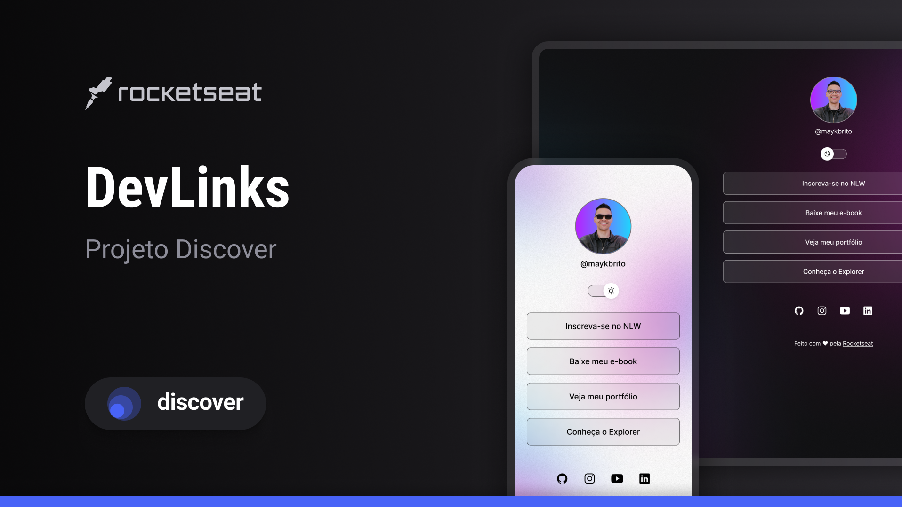

<h1 align="center"> DevLinks </h1>

  Projeto de um agregador de links no estilo "link in bio", desenvolvido durante o curso Discover da Rocketseat.

  <a href="#-tecnologias">Tecnologias</a>&nbsp;&nbsp;&nbsp;|&nbsp;&nbsp;&nbsp;
  <a href="#-projeto">Projeto</a>&nbsp;&nbsp;&nbsp;|&nbsp;&nbsp;&nbsp;
  <a href="#-layout">Layout</a>&nbsp;&nbsp;&nbsp;|&nbsp;&nbsp;&nbsp;
  <a href="#memo-licença">Licença</a>

  

 

  

## 🚀 Tecnologias

Esse projeto foi desenvolvido com as seguintes tecnologias:

- HTML e CSS
- JavaScript
- Git e Github
- Figma

## 💻 Projeto

O DevLinks é um agregador de links para ser usado como um cartão de visitas online. O projeto conta com um seletor de tema (claro/escuro) que se adapta às preferências do usuário, salvando a escolha para visitas futuras.

## 🎓 Aprendizados

Este foi meu primeiro projeto de estudo utilizando essas tecnologias, e ele me proporcionou uma base sólida nos seguintes conceitos:

- **Estruturação Semântica com HTML:** Utilização de tags como `header`, `main`, e `footer` para criar uma página bem estruturada e acessível.
- **Estilização com CSS:**
  - Uso de **Flexbox** para criar layouts flexíveis e alinhados.
  - Implementação de um seletor de tema (claro/escuro) através de **variáveis CSS** e classes no corpo do documento.
  - Aplicação de **animações, transições e efeitos de hover dinâmicos** para uma experiência de usuário mais fluida e agradável.
- **Manipulação do DOM com JavaScript:**
  - Seleção de elementos da página.
  - Adição e remoção de classes para alterar a aparência e o estado dos componentes (como o switch de tema).
  - Escuta de eventos do usuário, como o clique, para executar funções.
  - **Uso do `localStorage`** para persistir dados no navegador, como a preferência de tema do usuário.
- **Versionamento com Git e GitHub:** Prática dos comandos básicos do Git e organização do projeto em um repositório no GitHub.

## 🔖 Layout

Você pode visualizar o layout do projeto através [DESSE LINK](https://www.figma.com/design/ea5k8foRnvNpgiRRcWesZA/DevLinks-%E2%80%A2-Projeto-Discover--Community-?node-id=10-620&t=eQpYimSajMdf1yVp-1). É necessário ter conta no [Figma](https://figma.com) para acessá-lo.

## :memo: Licença

Esse projeto está sob a licença MIT.

---

Feito com ♥ by Márcio Sykes :wave:
